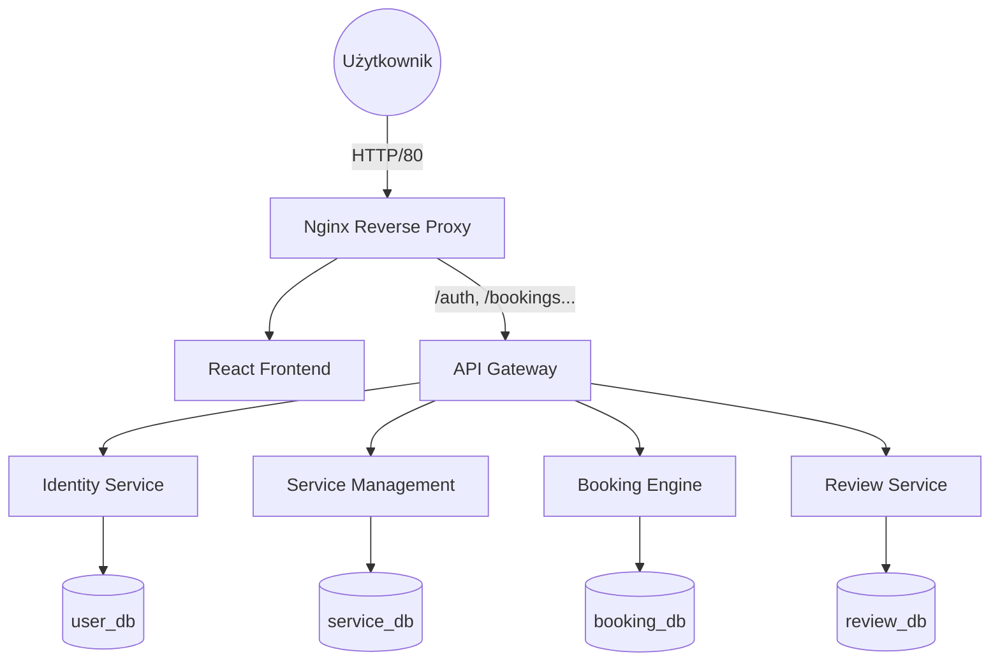

# 🏎️ CarWorkshop Premium Service
## Kompleksowa Platforma Zarządzania Serwisem Samochodowym (Microservices Architecture)

CarWorkshop to skalowalny system klasy Enterprise przeznaczony do kompleksowej obsługi sieci warsztatów samochodowych. Projekt demonstruje wykorzystanie nowoczesnych wzorców architektonicznych, takich jak **Microservices**, **API Gateway** oraz **Database per Service**, wdrożonych w pełni w środowisku chmurowym **AWS**.

---

## 📖 Spis Treści
1. [Wizja Projektu](#-wizja-projektu)
2. [Architektura Systemu](#-architektura-systemu)
3. [Szczegóły Mikroserwisów](#-szczegóły-mikroserwisów)
4. [Dokumentacja API](#-dokumentacja-api)
5. [Infrastruktura i Chmura (AWS)](#-infrastruktura-i-chmura-aws)
6. [Bazy Danych](#-bazy-danych)
7. [Uruchomienie i Konfiguracja](#-uruchomienie-i-konfiguracja)
8. [Rozwój i Skalowanie](#-rozwój-i-skalowanie)

---

## 🎯 Wizja Projektu
System ma na celu automatyzację procesu umawiania wizyt serwisowych, optymalizację pracy mechaników oraz budowanie relacji z klientem poprzez transparentny system ocen i historii napraw. 

**Kluczowe cele:**
- **Wysoka dostępność:** Dzięki rozproszeniu na mikroserwisy, awaria jednego modułu (np. ocen) nie blokuje procesu rezerwacji.
- **Skalowalność:** Każdy serwis może być niezależnie replikowany w zależności od obciążenia.
- **Bezpieczeństwo:** Izolacja baz danych i autoryzacja oparta o standard JWT.

---

## 🏗️ Architektura Systemu

System składa się z 6 głównych kontenerów współpracujących w jednej sieci wirtualnej:



---

## 🧩 Szczegóły Mikroserwisów

### 1. Identity Service (Port 8000)
Serce bezpieczeństwa systemu. Odpowiada za cykl życia użytkownika.
- **Funkcje:** Rejestracja, logowanie, walidacja tokenów JWT, zarządzanie rolami (USER, ADMIN).
- **Technologia:** FastAPI + Passlib (bcrypt).

### 2. Service Management (Port 8001)
Moduł administracyjny definiujący strukturę biznesową.
- **Funkcje:** Zarządzanie lokalizacjami, katalog marek, definicje usług, kadry (mechanicy), godziny pracy i wyjątki (urlopy/święta).
- **Relacje:** Łączy mechaników z konkretnymi usługami i warsztatami.

### 3. Booking Engine (Port 8002)
Najbardziej złożony moduł odpowiedzialny za logikę dostępności.
- **Funkcje:** Wyliczanie wolnych slotów, sprawdzanie konfliktów w kalendarzu, walidacja czasu trwania usługi.
- **Algorytm:** Bierze pod uwagę godziny pracy lokalu, nieobecności mechaników oraz istniejące już rezerwacje.

### 4. Review Service (Port 8003)
Moduł zbierający feedback od użytkowników.
- **Funkcje:** Dodawanie ocen (1-5), komentarzy, wyliczanie średniej oceny dla warsztatu.

---

## 📡 Dokumentacja API (Najważniejsze Endpointy)

### Użytkownicy & Autoryzacja
- `POST /auth/register` - Rejestracja nowego konta.
- `POST /auth/login` - Logowanie i odbiór tokena JWT.
- `GET /auth/me` - Pobranie danych profilowych zalogowanego użytkownika.

### Zarządzanie Warsztatem
- `GET /locations/` - Lista wszystkich dostępnych warsztatów.
- `POST /locations/` - (Admin) Dodanie nowej placówki.
- `POST /services/locations/{id}/services` - (Admin) Dodanie usługi do cennika warsztatu.
- `POST /employees/locations/{id}/employees` - (Admin) Przypisanie mechanika do warsztatu.

### Rezerwacje
- `GET /bookings/available-slots/{service_id}` - Pobranie wolnych godzin dla konkretnej daty.
- `POST /bookings/` - Utworzenie rezerwacji wizyty.
- `GET /bookings/me` - Lista wizyt przypisanych do zalogowanego użytkownika.

---

## ☁️ Infrastruktura i Chmura (AWS)

Projekt został zaprojektowany pod infrastrukturę **AWS Cloud** (region `eu-central-1`):

*   **EC2 (Elastic Compute Cloud):** Instancja `t3.micro` działająca pod kontrolą Amazon Linux. Hostuje cały stos Dockerowy.
*   **RDS (Relational Database Service):** Instancja `db.t3.micro` z silnikiem PostgreSQL 16. Odseparowanie bazy od serwera aplikacji zapewnia wyższą stabilność i bezpieczeństwo.
*   **VPC Security Groups:** 
    *   `Web-SG`: Ruch HTTP (80) i SSH (22).
    *   `DB-SG`: Ruch SQL (5432) dozwolony tylko z adresu IP serwera aplikacji.

---

## 🗄️ Bazy Danych
Zastosowano model **Database per Service**. Każdy serwis posiada własną, odizolowaną bazę danych, co zapobiega powstawaniu tzw. "Distributed Monolith".

- **user_db:** Tabele `users`.
- **service_db:** Tabele `locations`, `services`, `employees`, `car_brands`, `business_hours`.
- **booking_db:** Tabele `bookings`.
- **review_db:** Tabele `reviews`.

---

## 🏁 Uruchomienie i Konfiguracja

### Lokalnie (Development)
1. Sklonuj repozytorium.
2. Uruchom kontenery:
```bash
docker-compose up --build
```
3. Zasil bazę danymi testowymi:
```bash
python seed_data.py
```

### Produkcyjnie (AWS)
Adres publiczny: `http://63.177.137.197`
Wszystkie konfiguracje środowiskowe znajdują się w pliku `.env` na serwerze (nie dołączanym do repozytorium ze względów bezpieczeństwa).

---

## 🚀 Rozwój i Skalowanie
Możliwe kierunki rozbudowy projektu:
- **Płatności:** Integracja z bramką Stripe/PayPal (nowy mikroserwis `payment-service`).
- **Powiadomienia:** Wysyłka SMS/Email o zbliżającym się terminie wizyty.
- **Monitoring:** Wdrożenie stosu ELK (Elasticsearch, Logstash, Kibana) do centralizacji logów z mikroserwisów.
- **CI/CD:** Automatyzacja wdrożeń przez GitHub Actions bezpośrednio na EC2.

---

**© 2026 CarWorkshop Premium Service**  
*Projekt przygotowany jako demonstracja zaawansowanej architektury rozproszonej i wdrożeń chmurowych.*
